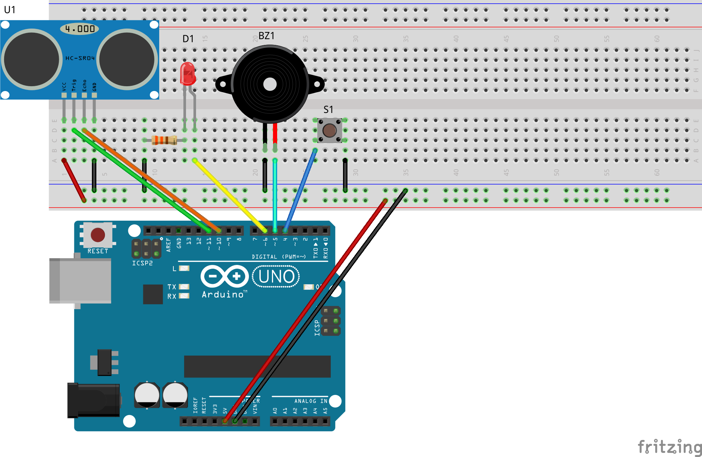

# PBL-Intro2IoT
This document describes a Project-Based Learning (PBL) activity for the Introduction to IoT course offered by Dawson College’s Electrical Engineering Technology Department.

# 🐾 Smart Pet Feeder Alert System

> A quick, Arduino‐based IoT project that **blinks an LED** and **sounds a buzzer** when your cat or dog’s food bowl is empty—plus a one-press mute that automatically re-arms after you refill the bowl.

  

---

## ✨ Features
| ✓ | Description |
|---|-------------|
| **Ultrasonic sensing** | HC-SR04 measures food height every 200 ms. |
| **Active buzzer + LED** | Instant visual & audible alert. |
| **Push-button override** | One press silences the alert until the bowl is refilled. |
| **Self-reset** | Alarm re-enables automatically once food is detected again. |
| **Minimal parts** | No extra resistors except the LED’s 330 Ω series resistor. |
| **Open-source** | GNU-licensed code, Fritzing schematic and report included. |

---

## 🛠 Bill of Materials

| Qty | Part | Notes |
|-----|------|-------|
| 1 | **Arduino Uno / Nano** | 5 V logic. |
| 1 | **HC-SR04** ultrasonic sensor | Trigger pin → D11, Echo → D10. |
| 1 | **Active piezo buzzer** | + → D5, − → GND. |
| 1 | **5 mm red LED** | Anode → **330 Ω** → D6, cathode → GND. |
| 1 | **Momentary push-button** | One leg → D4, other → GND. |
| — | Jumper wires & breadboard | Standard half-size board is fine. |

---

## 🔌 Circuit

  

